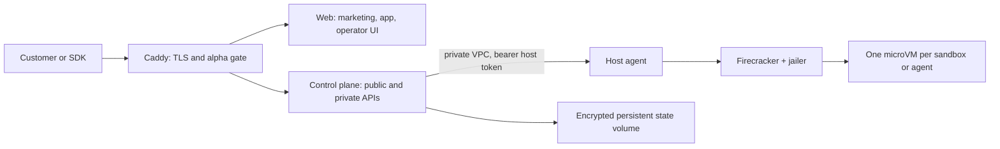

# Hosting AgentPop at agentpop.cloud

This document is the production handoff for the first AgentPop hosted alpha.
The open-source deployment and the hosted service use the same web,
control-plane, SDK, CLI, MCP, host-agent, and Firecracker runtime code.

## Deployment status

Current hosted-test deployment, verified July 25, 2026:

| Resource | Current value |
| --- | --- |
| GCP project | `agentpop-test-20260724-24322` |
| Management VM | `agentpop-control`, `e2-micro`, `us-west1-b` |
| Static public IP | `35.252.115.228` (`agentpop-management-ip`, `IN_USE`) |
| Public edge | Caddy v2.11.4 on TCP 80/443 and UDP 443 |
| Web upstream | Nginx on `127.0.0.1:8088` |
| Control plane | Go service on `127.0.0.1:8080` |
| Connector broker | Node service on `127.0.0.1:7070`, live Composio |
| Data-plane VM | `agentpop-firecracker-test`, `n2-standard-4`, `us-west1-b`; `TERMINATED` after July 25 validation |
| Data-plane runtime | Firecracker v1.16.1 with KVM/jailer |

The code, web UI, systemd services, Caddy routing, firewall, real Composio
catalog/invocation, Firecracker create/exec, logs, and preview path are deployed
and verified. The remaining domain activation step is the IONOS DNS edit below.

## Trust boundaries



- Only ports 80 and 443 are public on the management VM.
- Port 9090 is private and only accepts traffic from the management instance
  to tagged data-plane hosts.
- The public API requires bearer credentials.
- The private API requires a signed owner session and is not routed by
  `api.agentpop.cloud`.
- Preview URLs are routed separately and enforce each port's public,
  signed-link, or organization mode.
- Firecracker hosts require Linux KVM and nested virtualization; the macOS
  Docker runtime is a compatibility environment, not a production tenant
  boundary.

## Domain routing

The first alpha uses one static IPv4 address with Caddy automatic HTTPS:

| Host | Purpose |
| --- | --- |
| `agentpop.cloud` | Public marketing site |
| `www.agentpop.cloud` | Public marketing alias |
| `app.agentpop.cloud` | Customer dashboard, alpha-gated |
| `admin.agentpop.cloud` | Owner-only operator console, alpha-gated |
| `api.agentpop.cloud` | Public SDK/CLI/MCP API |
| `preview.agentpop.cloud` | Path-based sandbox previews |

Caddy obtains and renews certificates from a public ACME issuer. Do not buy an
IONOS hosting plan or paid SSL certificate for this topology.

After `deploy/gcp/deploy-management.sh` prints the reserved IP, update only
these IONOS DNS records:

| Type | Host | Value |
| --- | --- | --- |
| A | `@` | `35.252.115.228` |
| CNAME | `www` | `agentpop.cloud` |
| A | `app` | `35.252.115.228` |
| A | `admin` | `35.252.115.228` |
| A | `api` | `35.252.115.228` |
| A | `preview` | `35.252.115.228` |

Replace the IONOS default-site `A @ = 74.208.236.65` record and remove the
default-site `AAAA @ = 2607:f1c0:100f:f000::200` record. The GCP management
edge currently has no public IPv6 address, so leaving the old AAAA record would
send some visitors to the wrong site. Keep all MX, SPF, DKIM, DMARC, and other
mail records unchanged. Caddy will request every certificate automatically
after public DNS propagation; do not buy an IONOS SSL product.

## Build the hosted images

```bash
export AGENTPOP_PROJECT_ID=agentpop-test-20260724-24322
export AGENTPOP_REGION=us-west1
export AGENTPOP_IMAGE_TAG="$(git rev-parse --short HEAD 2>/dev/null || date +%Y%m%d%H%M%S)"

./deploy/gcp/build-images.sh
```

The script creates an `agentpop` Artifact Registry repository when necessary,
submits the builds to Cloud Build, and prints immutable image references.

## Configure secrets

Copy `deploy/hosted/.env.example` to a file outside source control. Generate
independent random values:

```bash
openssl rand -hex 32
printf '%s' 'OWNER_PASSWORD' | shasum -a 256
docker run --rm caddy:2-alpine caddy hash-password
```

When storing a Caddy bcrypt hash in a Compose `.env` file, wrap it in single
quotes so Compose does not interpolate `$`. Never reuse the control-plane API
key, host token, encryption key, owner session secret, or alpha password.

## Recreate the management VM

The current management VM already exists. The deployment script is for
reprovisioning or creating another environment; it creates billable resources,
so inspect it first.

```bash
export AGENTPOP_HOSTED_ENV=/absolute/path/to/agentpop-hosted.env
export AGENTPOP_IMAGE_TAG=YOUR_IMAGE_TAG
./deploy/gcp/deploy-management.sh
```

Start the current data plane only when sandbox capacity is required:

```bash
gcloud compute instances start agentpop-firecracker-test \
  --project=agentpop-test-20260724-24322 \
  --zone=us-west1-b
```

Stop it when the alpha is not being exercised:

```bash
gcloud compute instances stop agentpop-firecracker-test \
  --project=agentpop-test-20260724-24322 \
  --zone=us-west1-b
```

Cost-control rule: a deployment or live verification task may start the data
plane, but it must stop the instance again when the test finishes unless the
operator explicitly requests an always-on data plane. Stopping the VM removes
N2 CPU/RAM charges; the persistent disk and reserved/static resources continue
to incur their normal storage/address charges where applicable.

## Current alpha access boundary

The hosted dashboard uses a signed server-side GitHub session and an explicit
GitHub login allowlist. Programmatic customer access uses scoped API keys.
The owner console has a separate signed owner session, and Caddy does not route
private owner APIs through `api.agentpop.cloud`. Anonymous customer resource
requests return `401`.

This is still an invite-only hosted test, not unrestricted multi-tenant
production. Before public signup, add organizations/projects and tenant filters
to every resource, move state to a transactional database, move deployment
secrets to Secret Manager/KMS, and add automated backups, rate limits, abuse
controls, and metering reconciliation.

## Open-source and hosted split

Keep runtime correctness and portable APIs in the public repository. Hosted
commercial value belongs in operations: managed upgrades, regional capacity,
backups, SLOs, billing, abuse response, and support. Do not make Firecracker
isolation or core API correctness proprietary; that would weaken both the
community edition and the hosted service.
