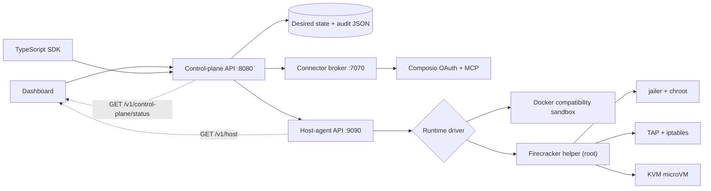

# AgentPop implementation handoff

## Outcome

This repository now contains a functioning vertical slice rather than a UI-only
prototype:

- A React dashboard with the supplied customer screens and one HTTP API
  adapter. There is no browser-side demo, seed, or in-memory fallback.
- A Go control plane with persisted desired state, lifecycle APIs, agents,
  connector catalog, audit events, health, capacity, usage, and quotas.
- A separate Go host agent that exposes the data plane.
- A separate Node connector broker that keeps the Composio platform key and
  provider account lifecycle outside the dashboard, agents, and sandboxes.
- Customer-visible sandbox logs backed by real runtime stdout/stderr and
  lifecycle events. Secret values are redacted before persistence and command
  text is not persisted.
- A local Docker runtime for macOS development.
- A Linux-only privileged Firecracker runtime helper using KVM, `jailer`,
  cloned ext4 root filesystems, TAP networking, NAT, metadata blocking, egress
  rules, generated SSH credentials, and cleanup.
- Zero-dependency TypeScript and Python SDKs.
- Open AgentOps-compatible eval suites, sandbox execution, deterministic
  checks, optional model rubrics, release gates, and persisted results.
- An OpenAPI 3.1 contract.
- Caddy on the management VM for the public 80/443 edge, automatic TLS, host
  boundaries, and routing to loopback-only Nginx/control-plane services.

The implementation intentionally exposes the normally hidden boundary:



The public control plane never calls Firecracker or manipulates networking
directly. It sends runtime requests to a host agent. The host agent chooses the
configured driver and delegates only privileged Firecracker operations to the
small Linux helper.

## Local development

macOS has no `/dev/kvm`, so local mode uses Docker while preserving the same
resource and lifecycle contract.

```bash
pnpm install
export COMPOSIO_API_KEY=... # server-side only; omit if not testing connectors
docker compose up --build
```

URLs:

- Containerized product: `http://127.0.0.1:8088`
- Hot-reload dashboard: `http://127.0.0.1:5173`
- Control plane in `make up` mode: `http://127.0.0.1:8080`
- Host agent in `make up` mode: `http://127.0.0.1:9090`

To run the hot-reload UI against the containerized connector-enabled stack:

```bash
VITE_API_URL=http://127.0.0.1:8088 \
  pnpm --filter @agentpop/web dev --host 127.0.0.1
```

Run the lifecycle check from a second terminal:

```bash
make smoke
```

Manual API example:

```bash
curl -X POST http://127.0.0.1:8080/v1/sandboxes \
  -H 'content-type: application/json' \
  -H 'idempotency-key: my-first-sandbox' \
  --data '{
    "name": "first-box",
    "vcpu": 1,
    "memoryMb": 1024,
    "diskGb": 10,
    "allowedEgress": ["github.com:443"],
    "environment": {"WORKLOAD": "demo"}
  }'
```

Retrieve the exact SSH command:

```bash
curl http://127.0.0.1:8080/v1/sandboxes/SANDBOX_ID/ssh | jq -r .command
```

## GCP Firecracker development host

### Current host (July 24, 2026)

The active Firecracker validation host now lives on a dedicated test account:

| Field | Value |
|---|---|
| Account | `moveinmoveout.me@gmail.com` (gcloud configuration `agentpop-test`) |
| Project | `agentpop-test-20260724-24322` |
| Instance | `agentpop-firecracker-test` |
| Zone | `us-west1-b` |
| Shape | `n2-standard-4`, nested virtualization, Ubuntu 24.04, 50 GB pd-balanced |
| Firecracker | v1.16.1 + jailer, assets in `/var/lib/agentpop/assets` |
| Host agent | `agentpop-host-agent.service`, token in `/etc/agentpop/host-agent.env` |
| Control plane | Separate `agentpop-control` management VM; public test entry `http://35.252.115.228`, private control API `127.0.0.1:8080` |
| State | Firecracker proof passed; data-plane VM stopped after validation on July 25, 2026 to avoid idle N2 compute charges |

The July 24 repair found that runtime metadata survived a host restart while
all Firecracker processes and TAP devices were gone. The helper now verifies
PID identity and can restart a dead microVM from its existing jailed
`rootfs.ext4` without replacing `/workspace`. Sparse disk backups were taken
before recovery. Owner reconcile recovered both desired-running VMs; the dead
paused VM was resumed through the customer API and paused again. Current state
is two running VMs plus one intentionally paused VM. Full details:
`docs/claude-repair-audit.md`.

July 24, 2026 live validation of the then-current commit passed 10/10 checks
on the instance itself (no tunnel): healthy driver/KVM, microVM boot, guest
exec, byte-exact files, pause/resume, workspace fork, and the full template
pipeline — build in a microVM, immutable rootfs commit, boot-from-template
with build artifact present, deprecation 409 with existing VM preserved, and
snapshot removal. Evidence:
`docs/acceptance-evidence/firecracker-20260724T075009Z.jsonl`. Agent
secret-injection on Firecracker was validated in the July 23 run and was not
re-exercised in this pass.

Start/stop:

```bash
gcloud --configuration=agentpop-test compute instances start agentpop-firecracker-test \
  --project=agentpop-test-20260724-24322 --zone=us-west1-b
gcloud --configuration=agentpop-test compute instances stop agentpop-firecracker-test \
  --project=agentpop-test-20260724-24322 --zone=us-west1-b
```

### Previous host (July 23, 2026)

A development host was provisioned and validated on July 23, 2026:

| Field | Value |
|---|---|
| Project | `halper-app-20260719` |
| Instance | `agentplane-firecracker-dev` (legacy GCE resource name) |
| Zone | `us-west1-b` |
| Shape | `n2-standard-4` |
| OS | Ubuntu 24.04 x86_64 |
| Disk | 50 GB balanced persistent disk |
| Nested virtualization | Enabled |
| Firecracker | v1.16.1 during validation |
| Host-agent service | `agentplane-host-agent.service` during the recorded validation; reinstall with `scripts/firecracker/install-service.sh` to migrate to `agentpop-host-agent.service` |
| Current state | `TERMINATED` after validation to avoid idle compute charges |

Start the host when needed:

```bash
gcloud compute instances start agentplane-firecracker-dev \
  --project=halper-app-20260719 \
  --zone=us-west1-b
```

Open a local tunnel to the private host-agent port:

```bash
gcloud compute ssh agentplane-firecracker-dev \
  --project=halper-app-20260719 \
  --zone=us-west1-b \
  -- -N -L 19091:127.0.0.1:9090
```

Run a local control plane against it:

```bash
HOST_AGENT_URL=http://127.0.0.1:19091 \
CONTROL_PLANE_ADDR=127.0.0.1:18081 \
CONTROL_PLANE_STATE=.local/firecracker-control/state.json \
CONTROL_PLANE_MODE=development-firecracker \
go run ./cmd/control-plane
```

The sandbox SSH endpoint returns:

- `command`: one-shot `gcloud compute ssh ... --command 'sudo ssh ...'` from
  the developer laptop.
- `hostCommand`: direct host-to-microVM SSH for debugging after entering the
  data-plane host.

Inspect the data plane directly:

```bash
gcloud compute ssh agentplane-firecracker-dev \
  --project=halper-app-20260719 \
  --zone=us-west1-b

sudo systemctl status agentpop-host-agent
curl http://127.0.0.1:9090/v1/host | jq
sudo find /var/lib/agentpop/vms -maxdepth 2 -type f
sudo find /srv/jailer/firecracker -maxdepth 2 -type d
ip -o link show
```

Stop the host when it is not being used:

```bash
gcloud compute instances stop agentplane-firecracker-dev \
  --project=halper-app-20260719 \
  --zone=us-west1-b
```

## Validated paths

Local Docker:

- Control-plane and host-agent health.
- Create with 0.25/0.5 vCPU and 512 MiB memory.
- SDK create.
- Persisted create idempotency; a repeated key returned the original sandbox
  with `Idempotent-Replayed: true`.
- API exec with injected environment.
- Direct SSH with a generated Ed25519 key.
- Pause and resume.
- Audit events.
- Destroy and container cleanup.

GCP Firecracker:

- Nested KVM available at `/dev/kvm`.
- Firecracker and jailer installed.
- Jailed Ubuntu 24.04 microVM booted.
- `/workspace` initialized before the sandbox reaches `running`.
- Guest SSH readiness.
- API exec with persisted sandbox environment.
- Binary upload/download through the same file API as Docker.
- Public preview routing through the control-plane gateway.
- Workspace-preserving fork with inherited environment and policy.
- One-shot developer SSH and host-local SSH.
- Pause and resume through the Firecracker `/vm` API.
- Destroy cleanup verified for process, TAP device, jail directory, and runtime
  state.

SDK validation:

- TypeScript SDK create, exec, SSH discovery, and destroy against both Docker
  and Firecracker.
- Python SDK create, exec, SSH discovery, context-manager cleanup, and bytecode
  compilation against Docker.
- Eval scenario import against the existing Open AgentOps repository, real
  Docker-sandbox execution, metric and business-outcome scoring, persisted
  history, API-scope tests, and create/run/result inspection through the
  dashboard.

Connector validation:

- Live Composio catalog lookup and six launch providers.
- Real Composio Connect Link creation with single-use, expiring state.
- Callback verification against the active upstream account and toolkit.
- Exact tool-slug grants, optional per-agent connector enforcement, and MCP
  execution path.
- Upstream account revoke followed by local and agent-grant cleanup.
- Browser navigation from both local web ports to the real GitHub authorization
  screen through Composio.
- Read-only provider execution through the running connections: Gmail locally
  and GitHub on the hosted control plane. Provider content was not printed or
  written to acceptance evidence.

## Current API surfaces

Control plane:

- `/v1/control-plane/status`
- `/v1/data-plane/hosts`
- `/v1/platform/health`
- `/v1/catalog`
- `/v1/sandboxes`
- `/v1/sandboxes/{id}`
- `/v1/sandboxes/{id}/exec`
- `/v1/sandboxes/{id}/logs`
- `/v1/sandboxes/{id}/ssh`
- `/v1/sandboxes/{id}/files`
- `/v1/sandboxes/{id}/ports`
- `/preview/{id}/{port}/{path...}`
- `/v1/sandboxes/{id}/pause`
- `/v1/sandboxes/{id}/resume`
- `/v1/sandboxes/{id}:fork`
- `/v1/agents`
- `/v1/agents/{name}/eval-suites`
- `/v1/agents/{name}/eval-runs`
- `/v1/eval-suites/{id}`
- `/v1/eval-suites/{id}/runs`
- `/v1/eval-runs/{id}`
- `/v1/connectors`
- `/v1/connectors/catalog`
- `/v1/connectors/{id}/authorize`
- `/v1/connectors/composio/callback`
- `/v1/connectors/{id}/connections`
- `/v1/connectors/{id}/tools/{tool}`
- `/v1/templates`
- `/v1/networks`
- `/v1/storages`
- `/v1/webhooks`
- `/v1/audit-events`
- `/v1/members`
- `/v1/api-keys`
- `/v1/usage`
- `/v1/quotas`

Host agent:

- `/v1/host`
- `/v1/runtime/sandboxes`
- `/v1/runtime/sandboxes/{id}`
- `/v1/runtime/sandboxes/{id}/exec`
- `/v1/runtime/sandboxes/{id}/pause`
- `/v1/runtime/sandboxes/{id}/resume`

Owner-only operator API:

- `/private/v1/auth/login`
- `/private/v1/auth/session`
- `/private/v1/auth/logout`
- `/private/v1/overview`
- `/private/v1/control-plane`
- `/private/v1/data-plane/hosts`
- `/private/v1/data-plane/sandboxes`
- `/private/v1/data-plane/hosts/{id}/drain`
- `/private/v1/reconcile`
- `/private/v1/audit`
- `/private/v1/operations`
- `/private/v1/config`

The customer and owner credentials are deliberately separate. Private routes
reject customer API keys, and owner routes use a signed, expiring owner session.

## What is not production-ready yet

This is a validated developer preview, not a secure multi-tenant hosted
release. The next engineering work is:

1. Replace the local JSON state file with PostgreSQL, organizations/projects,
   hashed scoped API keys, transactional idempotency, and an asynchronous
   reconciliation queue.
2. Protect host-agent traffic with outbound mTLS rather than an SSH tunnel.
3. Add a static guest agent over vsock for exec/files/processes. The current
   proof uses SSH inside the guest.
4. Add cgroup v2 jail limits, network namespaces, nftables, anti-spoofing,
   rate limits, bounded logs, and a hardened production host image. The current
   helper has Firecracker memory/vCPU limits, a jail, per-VM TAP, NAT, metadata
   denial, and an IPv4 egress chain.
5. Implement durable snapshot-based pause/resume and fork. Current pause/resume
   freezes and resumes a live Firecracker process.
6. Productionize the working preview gateway, exposed ports, signed URLs,
   storage/network topology, templates, signed webhooks, and local metering:
   regional capacity, guest storage mounts, enforced overlay networks,
   durable webhook delivery, and a billing ledger remain. Template builds now
   run in a data-plane build sandbox and are committed into immutable images
   through the host agent (`docker commit` locally; template-rootfs snapshots
   in the Firecracker helper, pending live KVM validation).
   Provider OAuth, callback verification, MCP invocation, grants, and upstream
   revoke now work through the connector broker. Production connector work is
   organization/project ownership, durable database state, provider-specific
   least-privilege auth configuration, token lifecycle operations, and
   production observability.
7. Pin and verify Firecracker, guest kernel, and rootfs checksums instead of
   resolving the latest development artifacts.
8. Run the 100-cycle leak test, adversarial isolation suite, and density
   benchmarks before accepting untrusted tenants.

## Latest acceptance snapshot

`pnpm qa:product` was run against the containerized local stack on July 23,
2026. Evidence is in `docs/acceptance-evidence/latest.jsonl`.

- 82 PASS (includes `TPL-001/002/003`: real template build in a data-plane
  build sandbox, committed immutable image, persisted step logs, and
  deprecation enforcement)
- 0 FAIL
- 3 PARTIAL: runtime networks, guest storage mount/brokerage, customer
  identity/tenancy
- Firecracker recovery, SSH, agent-secret reapplication, and pause/resume were
  live-verified on the active Linux/KVM data plane on July 24, 2026.
- On July 24-25, 2026, the no-fallback HTTP UI, sandbox log endpoint/UI,
  Caddy edge, a new Firecracker sandbox, stdout/stderr capture, a public
  preview, the 1,000-item live Composio catalog, and a read-only GitHub
  Composio invocation were verified against running services.

All connector acceptance rows pass. The repository's existing UI audit records
50 passing route/control checks with screenshots in
`docs/acceptance-evidence/ui`.

## UI and screenshot handoff

- Claude Code repository handoff: `CLAUDE.md`
- Dashboard implementation guide: `ui_kits/dashboard/README.md`
- Saved screenshot index: `design-reference/createos/README.md`
- Claude prompt: `design-reference/createos/CLAUDE-DESIGN-PROMPT.md`
- Screenshot zip: `design-reference/createos-ui-reference.zip`

The implemented dashboard is original AgentPop branding and design. The
CreateOS images were used for feature inventory and information architecture,
not copied trademarks or marketing text.
