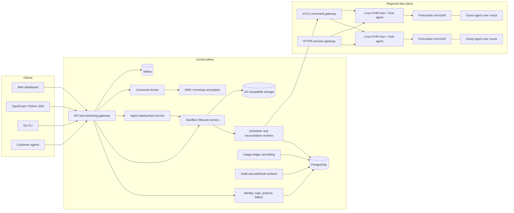
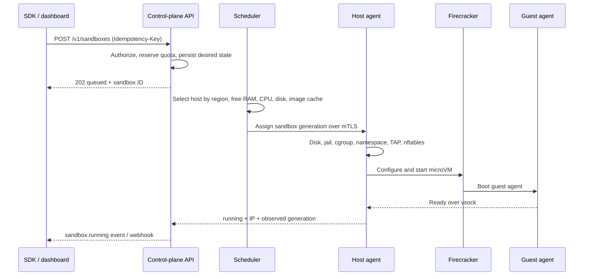

# Open-source sandbox and cloud-agent platform plan

## 1. Product decision

Build an open-source, self-hostable execution platform and operate the same core as a paid hosted cloud. The initial product is deliberately narrower than CreateOS:

- Firecracker sandboxes for untrusted and agent-generated code.
- Private sandbox networks, controlled egress, persistent storage, templates, public preview URLs, audit logs, and webhooks.
- TypeScript and Python SDKs plus a Go CLI.
- A connector broker that grants agents scoped access without exposing long-lived OAuth tokens.
- Cloud-agent deployment as a managed sandbox profile, beginning with one OpenClaw-compatible reference template.
- No managed databases, queues, general PaaS deployment, token network, or service marketplace in v1.

The commercial product is the hosted operation of this platform: customers pay for compute usage, storage, networking, maintained connectors, reliability, compliance, support, and enterprise controls. They do not pay merely to download the source.

## 2. Open-source and commercial boundary

Use a transparent open-core model:

| Area | Apache-2.0 community repository | Hosted/enterprise product |
|---|---|---|
| Runtime | API, scheduler, host agent, guest agent, Firecracker lifecycle | Managed regional fleets, upgrades, capacity guarantees |
| Product | Dashboard, CLI, SDKs, templates, networks, storage, webhooks, audit events | Multi-organization billing, abuse controls, long audit retention, SLAs |
| Connectors | Connector specification, broker, example connectors | Maintained OAuth applications, credential custody, provider support |
| Agents | Agent specification and reference agent template | One-click deployment, monitoring, autoscaling, managed model credentials |
| Deployment | Docker Compose, Helm, Terraform example | Operated SaaS and supported BYOC/VPC installation |

Keep the name and logo under a separate trademark policy. SDKs may use MIT; all infrastructure code uses Apache-2.0. Do not call a source-available license “open source.”

## 3. System architecture



### Control plane

Implement the control plane as a modular Go service first, not many independently deployed microservices. Ship separate process modes for `api`, `scheduler`, `worker`, `connector-broker`, and `edge-gateway`, while sharing packages and a single PostgreSQL schema.

- PostgreSQL is the source of truth for users, organizations, projects, sandboxes, desired state, placement, API keys, connector grants, usage, audit events, and webhooks.
- Use a transactional outbox and PostgreSQL `FOR UPDATE SKIP LOCKED` jobs in v1. Add NATS JetStream only when measured command volume or fan-out warrants it.
- Valkey holds distributed rate-limit counters, short-lived stream routing, and revocation caches. Nothing irreplaceable lives there.
- S3-compatible storage contains kernels, root filesystems, templates, VM snapshots, disk deltas, and customer exports. MinIO supplies the local-development implementation.
- Hosted secrets use AWS KMS envelope encryption. Self-hosted installations use the same interface backed by Vault or a local master key supplied through the deployment secret store.

### Data plane

Each regional data plane consists of Linux KVM hosts. A Go host agent opens an outbound mTLS connection to the command gateway, reports capacity and health, and reconciles assigned sandboxes.

For every sandbox, the host agent creates:

- One Firecracker process launched through `jailer`.
- A unique unprivileged UID/GID, chroot, cgroup v2 hierarchy, network namespace, TAP device, and nftables chain.
- A read-only cached base rootfs plus a per-sandbox writable ext4 disk created with reflink or thin provisioning.
- A small static guest agent reached through AF_VSOCK for exec, files, process management, health, and graceful shutdown.
- Resource controls for CPU, memory, disk I/O, file descriptors, process count, and network bandwidth.

Firecracker does not filter networking itself, so host-side controls are mandatory. Follow its production recommendations: jailer, seccomp, per-tenant Firecracker process, IMDS blocking, bounded logs, disabled swap/KSM, patched kernel and microcode, watchdog, and production evaluation with SMT disabled. See the [Firecracker production host guide](https://github.com/firecracker-microvm/firecracker/blob/main/docs/prod-host-setup.md).

### Lifecycle



The API writes desired state; host agents report observed state. Every operation is idempotent and generation-numbered so retries cannot create duplicate VMs.

Pause creates a Firecracker state/memory snapshot and a consistent disk checkpoint, uploads durable artifacts to object storage, then releases CPU/RAM. Resume places the sandbox on a compatible host, downloads or reuses cached artifacts, restores networking rules before reachability, and restores the VM. Host-kernel compatibility must be pinned because Firecracker warns that snapshot load across different host kernels is unstable. Fork ships after pause/resume is reliable; it clones a durable disk/snapshot and copies security policy atomically.

## 4. Tenant and access model

Use this hierarchy from the first migration:

`user -> organization -> project -> sandbox / agent / connector grant`

Roles are organization owner, organization admin, project developer, project operator, and project viewer. API keys are hashed at rest, shown once, expire, and contain project scopes such as `sandbox:write`, `sandbox:exec`, `connector:invoke`, or `audit:read`.

Agents and guest VMs receive short-lived workload identity tokens bound to one sandbox and one generation. Never inject control-plane API keys or raw OAuth refresh tokens into a VM. The connector broker exchanges a workload token plus connector grant for a narrowly authorized provider operation and records the invocation in the audit log.

## 5. Public API and SDK contract

Define the REST contract in OpenAPI 3.1 before implementing the UI. Generate the low-level TypeScript and Python clients, then add small handwritten ergonomic layers. Use HTTPS JSON for resource operations and WebSocket streams for terminal/exec; use SSE for lifecycle events and logs where bidirectional input is unnecessary.

Core resources and operations:

- `/v1/sandboxes`: create, list, get, update shape, destroy.
- `/v1/sandboxes/{id}:pause|resume|fork`: asynchronous lifecycle operations.
- `/v1/sandboxes/{id}/exec`, `/shell`, `/files`, and `/ports`: command, terminal, file, and preview access.
- `/v1/templates`: build, version, list, deprecate.
- `/v1/networks` and membership endpoints: private network lifecycle and attach/detach.
- `/v1/storages`: encrypted S3-compatible registrations and sandbox attachments.
- `/v1/agents`: create, deploy, stop, restart, logs, and status.
- `/v1/connectors`, `/connections`, and `/grants`: catalog, OAuth connection, and project/agent access.
- `/v1/webhooks`, `/v1/audit-events`, `/v1/api-keys`, `/v1/usage`, and `/v1/quotas`.

Sandbox states are `queued`, `provisioning`, `running`, `pausing`, `paused`, `resuming`, `deleting`, `deleted`, and `failed`. Mutations accept an `Idempotency-Key`; asynchronous operations return an operation resource. Webhooks are HMAC-signed and retried with exponential backoff.

## 6. Networking, ingress, and egress

- Allocate every sandbox an address from a host-managed private range; never expose TAP interfaces directly to the Internet.
- Default-deny host metadata, control-plane ranges, other tenants, and RFC1918 destinations not explicitly attached to the sandbox network.
- Implement IP/CIDR/port egress rules in per-VM nftables chains. Domain allowlists use a transparent proxy that validates TLS SNI or HTTP Host; document that plaintext HTTP domains do not provide cryptographic destination identity.
- Private networks use a tenant-specific subnet and host routes over a WireGuard overlay. nftables marks and network namespaces prevent cross-network traffic.
- Public previews use `https://<sandbox>-<port>.<region>.sandbox.example.com`, wildcard DNS/TLS, and a preview gateway that routes to the owning host. Support public, organization-authenticated, and signed-link modes.
- Shell and exec streams are authenticated independently and close immediately on token expiry, sandbox generation change, or permission revocation.

## 7. Connectors and cloud agents

Connectors are not packages copied into each VM. They are centrally governed credentials and tools:

1. A user completes provider OAuth in the control plane.
2. The encrypted refresh token is stored in the credential vault.
3. An administrator grants a project or agent selected actions and resources.
4. The agent calls the connector broker with its workload token.
5. The broker performs or proxies the provider call, applies rate and policy checks, and audits the result.

Launch with GitHub, Slack, Gmail, and Google Drive. Add Calendar, Notion, Linear, and Stripe only after the broker, token rotation, revocation, and audit model are proven.

An agent is a declarative profile over a long-running sandbox, not a new virtualization primitive. `AgentSpec` contains template/image, command, model provider and model, secret references, connector grants, resource shape, trigger/channel configuration, idle policy, and restart policy. Ship an OpenClaw-compatible template as the first example, but keep the platform framework-neutral.

## 8. Hosted GCP topology and starting sizes

Use one region for the invite-only alpha. The checked-in deployment targets
`us-west1` in project `halper-app-20260719`, while keeping all identifiers
configurable for open-source users.

| Component | Alpha deployment |
|---|---|
| TLS and routing | Caddy on one management VM with automatic ACME certificates |
| Web dashboard | Nginx static image on the management VM |
| API and lifecycle worker | One control-plane container with a persistent disk-backed state volume |
| Sandbox host | Existing `n2-standard-4` nested-virtualization development VM |
| Guest isolation | Firecracker + jailer, one microVM per sandbox or agent |
| Image registry | Artifact Registry in `us-west1` |
| Private path | VPC firewall permits management-tagged instances to reach data-plane-tagged instances on TCP 9090 only |
| Public edge | One reserved IPv4 address; ports 80/443 only |

The single management VM and JSON state store are deliberately an alpha
topology. Before unrestricted signup, split the API and reconciler, replace the
state file with a transactional database, introduce durable queues and object
storage, run multiple management instances behind a load balancer, deploy
multiple data-plane hosts across zones, and add autoscaling, backups, WAF/rate
limits, monitoring, and metering reconciliation.

Keep control-plane workloads off Firecracker hosts. Reserve host CPU and memory
for the kernel, networking, jailer, and cache; determine sellable density from
repeatable create/exec/I/O/isolation benchmarks rather than theoretical
overcommit.

## 9. Repository shape

Use a monorepo with these ownership boundaries:

```text
apps/web                         marketing, customer, and owner UI
api/openapi.yaml                 public contract
api/private-openapi.yaml         owner-only contract
cmd/control-plane                REST API and reconciler
cmd/host-agent                   privileged data-plane daemon
cmd/firecracker-runtime          Firecracker lifecycle helper
cmd/agentpop                     Go CLI
cmd/agentpop-mcp                 MCP server
packages/sdk                     TypeScript SDK
sdk/python                       Python SDK
internal                         shared Go domain/runtime packages
images/devbox                    local sandbox image
scripts/firecracker              KVM host and rootfs installers
deploy/docker                    production images
deploy/hosted                    TLS and hosted Compose stack
deploy/gcp                       GCP build and deployment automation
compose.yaml                     single-host community deployment
```

## 10. One milestone: clone-complete product

There is one milestone: ship the open-source, self-hostable, and hosted
CreateOS-class product. Implementation work may run in parallel, but no partial
workstream is a separate product milestone.

The acceptance gate is defined in
[`docs/createos-gap-analysis.md`](createos-gap-analysis.md). In summary, every
customer-facing sandbox, agent, connector, API, SDK, CLI, MCP, and dashboard
capability must work end to end on the appropriate runtime. The Docker local
runtime and hosted Firecracker runtime must pass the same conformance suite.
Managed databases, caches, queues, and a general application PaaS are excluded.

Assume six full-time engineers: two virtualization/networking, two
control-plane/backend, one frontend, and one SDK/developer-experience engineer,
with part-time security/SRE review. Organize their work around the contract,
sandbox runtime, network/storage, agents/connectors, UI, hosted operations, and
verification workstreams in the gap analysis.

## 11. Tests and launch gates

- Unit/property tests for lifecycle transitions, idempotency, quota, placement, billing, and connector policy.
- Integration tests using real KVM hosts for create, exec, upload/download, port exposure, pause/resume, fork, destroy, and cleanup.
- Isolation tests for VM-to-host, VM-to-VM, metadata access, spoofed source IP/MAC, DNS rebinding, egress bypass, fork policy inheritance, and connector token exfiltration.
- Load tests for 100 then 1,000 simultaneous sandboxes, WebSocket fan-out, webhook retry, image-cache misses, and object-store throttling.
- Chaos tests for host loss, scheduler restart, database failover, full disk, corrupt snapshot, delayed heartbeat, and duplicate commands.
- Supply-chain controls: pinned Firecracker/kernel/rootfs releases, signed artifacts, SBOMs, image vulnerability scans, and reproducible guest images.

Initial customer-facing targets:

- Cached sandbox create-to-ready p95 below 2 seconds; uncached below 10 seconds.
- Exec stream first-byte p95 below 300 ms after the VM is ready.
- No resource leakage after 10,000 lifecycle iterations.
- Usage ledger discrepancy below 0.5% against host-level measurements.
- 99.9% control-plane API availability during public alpha; sandbox runtime SLO follows after failure-recovery behavior is proven.

## 12. Commercial packaging

- Free: limited monthly credits, one project, public community support.
- Developer: monthly platform fee plus metered compute/storage/egress.
- Team: organizations, roles, higher quotas, private previews, longer audit retention, maintained connectors.
- Enterprise: annual contract, SSO/SCIM, BYOC/VPC deployment, dedicated capacity, policy controls, support, and SLA.

Meter vCPU-seconds, GiB-seconds of active memory, disk GiB-hours, snapshot GiB-months, and Internet egress. Price only after density tests establish unit cost; target at least a 65% gross margin before discounts. Make idle pause and TTL defaults visible so usage feels predictable.

## 13. Immediate next actions

1. Run the full local Docker conformance flow after every contract change.
2. Reinstall the stopped GCP Firecracker host with the AgentPop service,
   validate the same conformance flow, and stop it again after testing.
3. Build the hosted images, create the management VM, and point the six IONOS
   records documented in `hosting-agentpop-cloud.md` at its reserved IP.
4. Keep the hosted UI alpha-gated until real customer identity, tenant
   enforcement, durable state, backups, rate limits, abuse controls, and
   metering are implemented.
5. Recruit three design partners: an AI coding agent, a CI runner use case, and
   a long-running tool-using agent.
